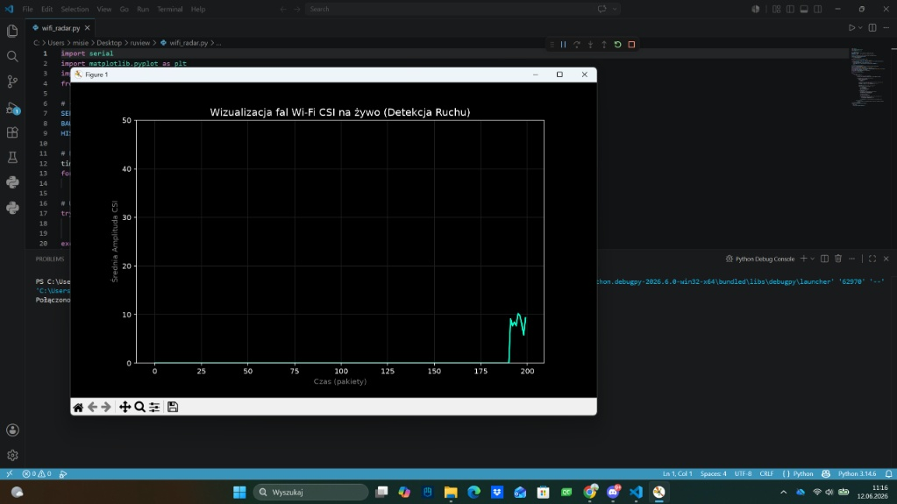

## Ewolucja projektu i przebieg prac

### 1. Pierwsze odebrane fale CSI
Pierwsze testy transmisji i parsowania surowych podnośnych CSI przesyłanych przez port szeregowy z mikrokontrolera ESP32 do skryptu wizualizacyjnego w Pythonie.

   
  <em>Rys. 1: Pierwsze pakiety CSI odebrane i wyrysowane w czasie rzeczywistym.</em>

---

### 2. Zsynchronizowany strumień danych
Optymalizacja bufora szeregowego (`ser.read(ser.in_waiting)`), co pozwoliło na uzyskanie stabilnego, ciągłego odczytu podnośnych z częstotliwością ~100 Hz bez gubienia pakietów.

   
  <em>Rys. 2: Stabilny strumień podnośnych po zsynchronizowaniu transmisji.</em>

---

### 3. Pierwsze widoczne amplitudy podczas przechodzenia pomiędzy płytkami
Rejestracja fizycznego tłumienia fal przez ciało człowieka. Przejście na linii wzroku (Line of Sight) między nadajnikiem TX a odbiornikiem RX powoduje wyraźny spadek amplitudy sygnału, co posłużyło jako podstawa do klasyfikacji strefowej (np. Biurko vs Kanapa).

   
  <em>Rys. 3: Wyraźny spadek amplitudy podczas przecięcia linii fal oraz wczesny moduł klasyfikacji strefowej.</em>

---

### 4. Trenowanie modelu uczenia maszynowego
Proces uczenia pierwszego modelu klasyfikacji na zebranym zbiorze danych pomiarowych wraz z analizą macierzy pomyłek (Confusion Matrix) oraz raportem metryk (Precision / Recall).

   
  <em>Rys. 4: Raport trenowania modelu na bazie próbek kalibracyjnych.</em>

---

### 5. Wielowęzłowy układ współrzędnych 2D
Rozbudowa systemu do konfiguracji z wieloma nadajnikami (Multi-TX) oraz przejście z klasyfikacji strefowej na ciągłą regresję współrzędnych kartezjańskich (X, Y).

   
  <em>Rys. 5: Testy pozycjonowania 2D z wykorzystaniem fuzji danych z wielu węzłów.</em>

---

### 6. Finalny projekt: Pasywny radar 2D w pokoju 1.6m x 4.6m
Ostateczna wersja systemu integrująca fuzję danych z 3 nadajników ESP32, normalizację wektora cech L2, model KNN oraz dwuwymiarowy filtr Kalmana tłumiący szumy wielodrogowości.

   
  <em>Rys. 6: Finalny radar 2D śledzący pozycję człowieka na żywo w zdefiniowanym obszarze pokoju.</em>

## Narzędzia i sprzęt

### Sprzęt:
* **4x ESP32 (NodeMCU / ESP32 WROOM):** 3 sztuki pracujące jako nadajniki pakietów (TX) i 1 sztuka jako odbiornik (RX) podłączony po USB.
* **Przewody micro-USB i zasilacze 5V:** Zapewnienie stabilnego zasilania dla płytek w celu uniknięcia spadków napięcia na modułach radiowych.

### Oprogramowanie i środowiska:
* **Arduino IDE:** Pisanie i wgrywanie firmware'u na ESP32, konfiguracja rejestrów Wi-Fi oraz obsługa funkcji CSI (`esp_wifi_set_csi_rx_cb`).
* **Visual Studio Code / Python 3:** Środowisko do pisania skryptów zbierania danych, trenowania modelu i aplikacji radaru.

### Wykorzystane biblioteki (Python):
* **`pyserial`:** Nieblokujący odczyt strumienia bajtów z portu szeregowego COM.
* **`numpy`:** Wektorowe operacje matematyczne, normalizacja L2 oraz implementacja macierzy filtru Kalmana.
* **`scikit-learn`:** Trenowanie modelu K-Nearest Neighbors (KNN), podział na zbiory testowe/treningowe i ewaluacja (macierz pomyłek).
* **`matplotlib`:** Renderowanie wykresów fal radiowych oraz interfejsu radaru live w czasie rzeczywistym.
* **`pickle`:** Zapisywanie wytrenowanego modelu AI do pliku `.pkl` i szybkie wczytywanie w pętli live.

---

## Czego się nauczyłem podczas projektu

1. **Niskopoziomowej obsługi Wi-Fi w mikrokontrolerach:** Jak dobrać się do surowych danych warstwy fizycznej (CSI) w ESP32, jak odczytywać amplitudy poszczególnych podnośnych OFDM i jak działa protokół ESP-NOW.
2. **Obsługi szybkiej transmisji szeregowej:** Jak radzić sobie z wąskim gardłem bufora UART przy strumieniu ponad 100 pakietów na sekundę (przejście z blokującego `readline()` na asynchroniczny bufor kołowy w RAM).
3. **Praktycznego dobierania modeli Machine Learning:** Dlaczego sztywne drzewa decyzyjne (Random Forest) zawodzą przy zaszumionych danych radiowych i dlaczego KNN z wagami odległościowymi znacznie lepiej radzi sobie z interpolacją punktów w przestrzeni.
4. **Rozwiązywania problemów sprzętowych programem:** Jak matematyczna normalizacja wektora cech (L2 Norm) pozwoliła całkowicie wyeliminować wpływ wbudowanego w chip układu automatycznej regulacji wzmocnienia (AGC).
5. **Implementacji Filtru Kalmana 2D od zera:** Jak za pomocą algebry liniowej i macierzy stanu ($A, H, Q, R$) narzucić prawa fizyki (bezwładność, prędkość) na skaczące odczyty radiowe, uzyskując płynną trajektorię ruchu.
6. **Fizyki fal radiowych w zamkniętych pomieszczeniach:** Jak w praktyce wygląda zjawisko wielodrogowości (odbicia fal od ścian, tłumienie przez ludzkie ciało) i dlaczego sama amplituda sygnału nie wystarcza do stworzenia idealnego, ciągłego radaru bez pomiaru czasu lotu fali (ToF).
