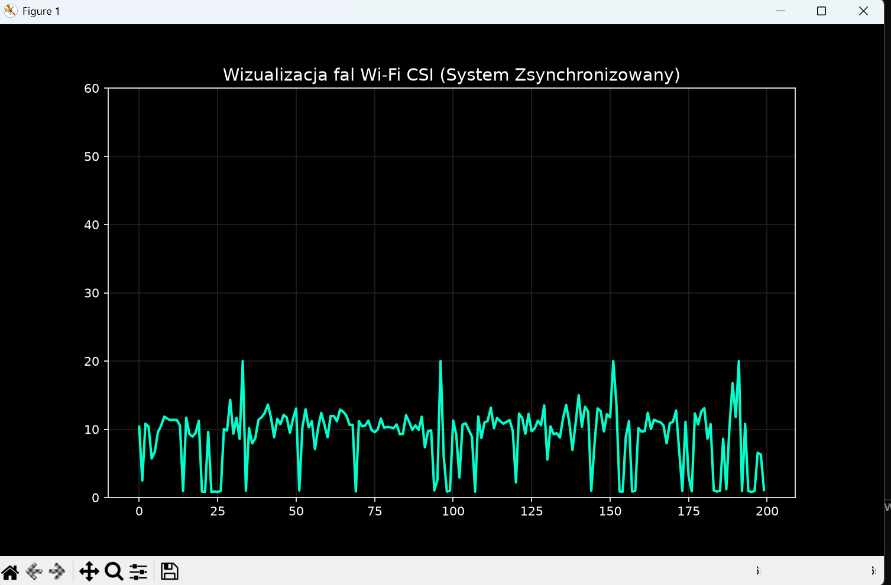
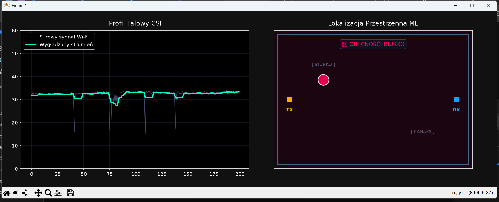
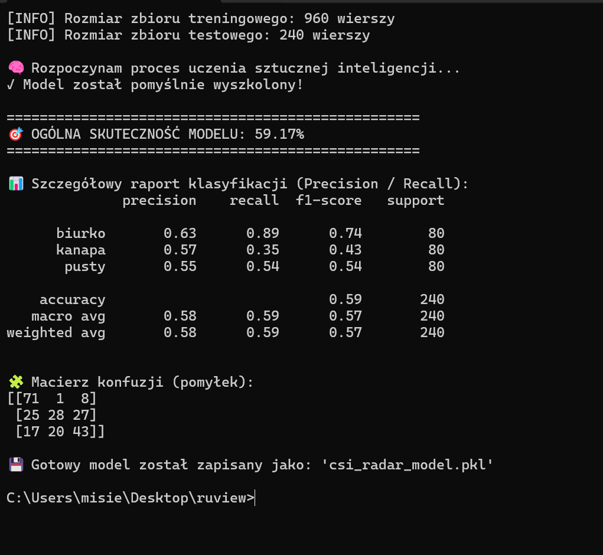
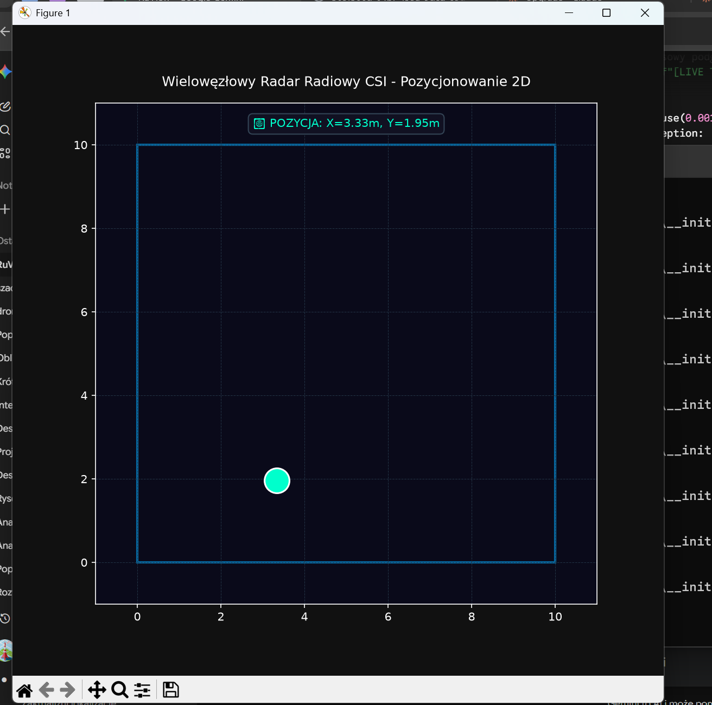
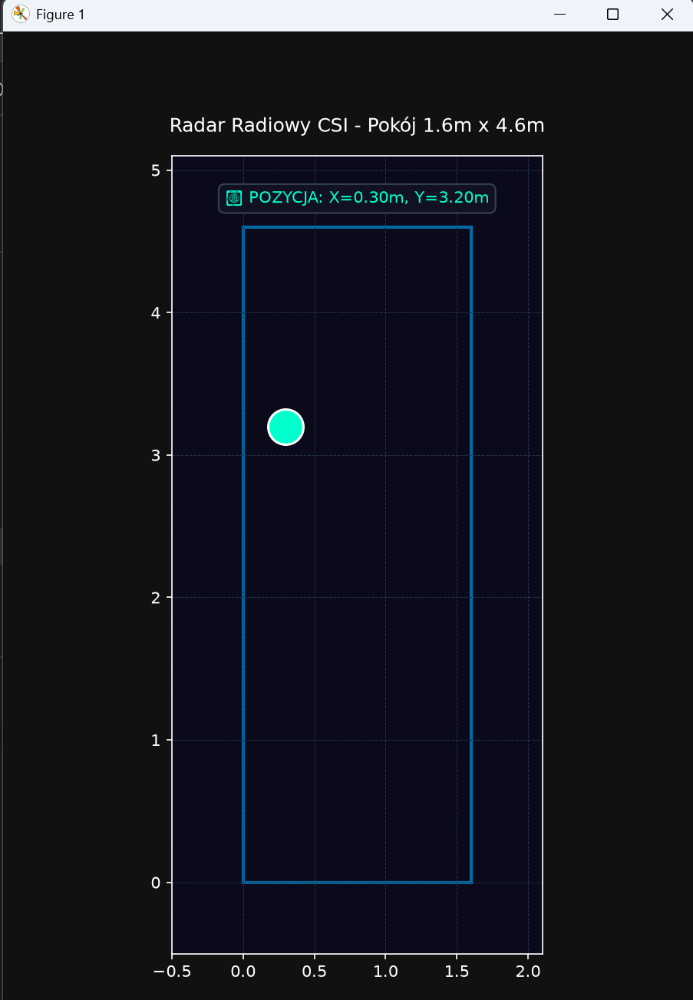

# Triangulacja 2D przy pomocy fal Wi-Fi

Pasywny system lokalizacji wewnątrzbudynkowej (Device-Free Indoor Localization) wykorzystujący analizę zakłóceń sygnału Wi-Fi CSI (Channel State Information) w paśmie 2.4 GHz oraz algorytmy uczenia maszynowego połączone z kinematycznym filtrem Kalmana 2D.

Projekt realizowany na Wydziale Mechatroniki Politechniki Warszawskiej.

---

## Ewolucja projektu i przebieg prac

### 1. Pierwsze odebrane fale CSI
Pierwsze testy transmisji i parsowania surowych podnośnych CSI przesyłanych przez port szeregowy z mikrokontrolera ESP32 do skryptu wizualizacyjnego w Pythonie.

*Rys. 1: Pierwsze pakiety CSI odebrane i wyrysowane w czasie rzeczywistym.*

---

### 2. Zsynchronizowany strumień danych
Optymalizacja bufora szeregowego (`ser.read(ser.in_waiting)`), co pozwoliło na uzyskanie stabilnego, ciągłego odczytu podnośnych z częstotliwością ~100 Hz bez gubienia pakietów.

*Rys. 2: Stabilny strumień podnośnych po zsynchronizowaniu transmisji.*

---

### 3. Pierwsze widoczne amplitudy podczas przechodzenia pomiędzy płytkami
Rejestracja fizycznego tłumienia fal przez ciało człowieka. Przejście na linii wzroku (Line of Sight) między nadajnikiem TX a odbiornikiem RX powoduje wyraźny spadek amplitudy sygnału, co posłużyło jako podstawa do klasyfikacji strefowej (np. Biurko vs Kanapa).

*Rys. 3: Wyraźny spadek amplitudy podczas przecięcia linii fal oraz wczesny moduł klasyfikacji strefowej.*

---

### 4. Trenowanie modelu uczenia maszynowego
Proces uczenia pierwszego modelu klasyfikacji na zebranym zbiorze danych pomiarowych wraz z analizą macierzy pomyłek (Confusion Matrix) oraz raportem metryk (Precision / Recall).

*Rys. 4: Raport trenowania modelu na bazie próbek kalibracyjnych.*

---

### 5. Wielowęzłowy układ współrzędnych 2D
Rozbudowa systemu do konfiguracji z wieloma nadajnikami (Multi-TX) oraz przejście z klasyfikacji strefowej na ciągłą regresję współrzędnych kartezjańskich (X, Y).

*Rys. 5: Testy pozycjonowania 2D z wykorzystaniem fuzji danych z wielu węzłów.*

---

### 6. Finalny projekt: Pasywny radar 2D w pokoju 1.6m x 4.6m
Ostateczna wersja systemu integrująca fuzję danych z 3 nadajników ESP32, normalizację wektora cech L2, model KNN oraz dwuwymiarowy filtr Kalmana tłumiący szumy wielodrogowości.

*Rys. 6: Finalny radar 2D śledzący pozycję człowieka na żywo w zdefiniowanym obszarze pokoju.*

---

## Architektura techniczna

### Hardware:
* 3x Nadajniki ESP32 (TX) rozsyłające pakiety w standardzie ESP-NOW.
* 1x Odbiornik ESP32 (RX) połączony kablem USB do PC (ekstrakcja 64 podnośnych CSI na każdy węzeł).

### Baza danych i przetwarzanie:
* Zebrano ponad 55 000 wierszy danych radiowych w siatce 22 punktów geometrycznych.
* Normalizacja L2 wektora wejściowego eliminująca wpływ układów AGC wbudowanych w chipy radiowe.
* Regresor KNN (K-Nearest Neighbors) estymujący współrzędne na bazie odległości euklidesowej.
* Dwuwymiarowy Filtr Kalmana (2D Kalman Filter) narzucający prawa kinematyki na wyjściowe pozycje X, Y.

---

## Wnioski inżynierskie

Projekt potwierdził możliwość śledzenia obecności i pozycji człowieka przy użyciu pasywnego profilowania fal Wi-Fi. Wykazał również, że w małych pomieszczeniach zjawisko wielodrogowości (odbicia od ścian) ogranicza dokładność czystej analizy amplitudy. Do uzyskania bezwzględnej dokładności centymetrowej w systemach przemysłowych konieczne jest stosowanie pomiaru czasu lotu fali (ToF, np. Ultra-Wideband) lub analizy kąta nadejścia fali (AoA).
